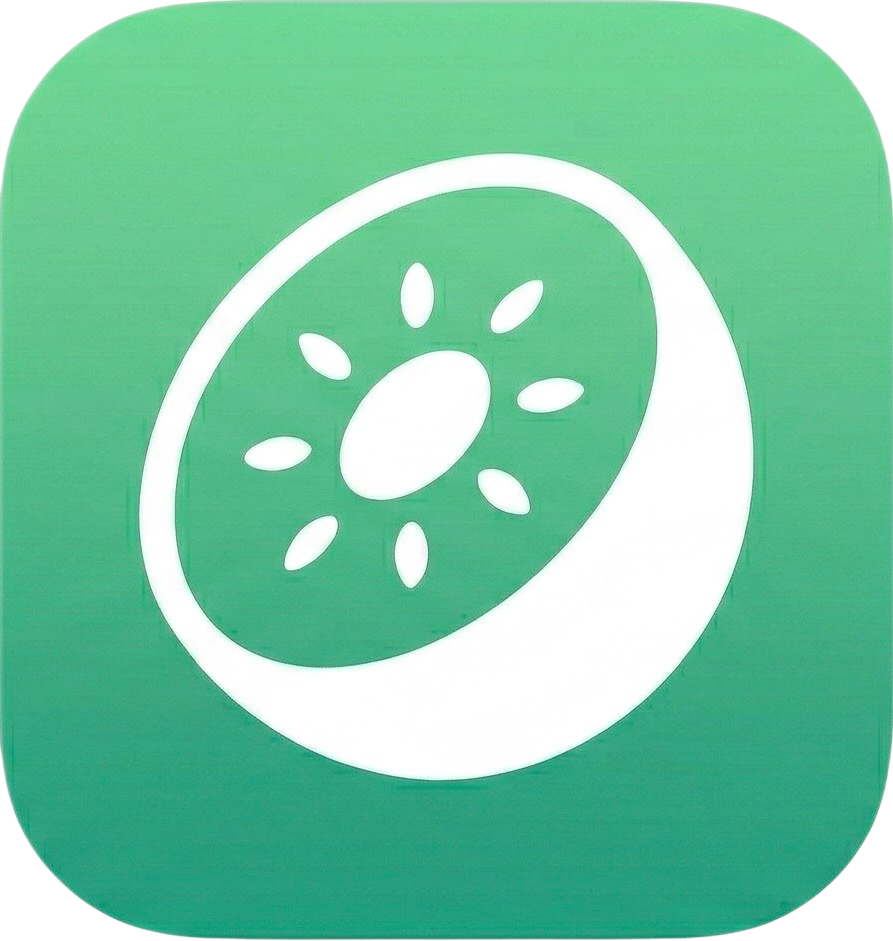

<p align="center">
  
</p>

<h1 align="center">Kivi</h1>

<p align="center">
  A high-performance, WYSIWYG-first Markdown editor and personal knowledge management system.<br/>
  Built as a reusable editor engine (<code>@kivi/editor-core</code>), a vault/knowledge layer (<code>@kivi/vault</code>), and a VS Code / Cursor extension.
</p>

## Features

### Editor (Phase 1)
- Full CommonMark + GFM support with lossless round-trip editing
- Block-level dirty tracking for minimal-diff serialization
- Bold, italic, underline, strikethrough, inline code, fenced code blocks
- Headings (H1–H6), lists (bullet, ordered, task), tables, blockquotes
- Links, images, horizontal rules, footnotes, math (KaTeX), frontmatter
- Smart clipboard (Markdown-aware paste/copy)
- In-document search with regex, replace, and highlighting
- Web Worker parsing for large files (>10KB)

### Knowledge Management (Phase 2)
- **Wiki-links** — `[[page-name]]` and `[[page-name|alias]]` with Obsidian-compatible syntax
- **Backlinks** — bidirectional link index, VS Code sidebar view, web demo panel
- **Tags** — `#tag-name` inline nodes with hierarchical support (`#project/kivi`)
- **Vault** — in-memory file index (`@kivi/vault`) with backlinks, tags, graph data
- **File Explorer** — VS Code sidebar tree + web demo file browser
- **Outline View** — heading tree for active document (both platforms)
- **Table of Contents** — `[TOC]` block with reactive NodeView
- **Slash Commands** — type `/` for a floating command palette with keyboard navigation
- **Image Paste** — paste images from clipboard (data URL or file storage adapter)
- **Themes** — dark, light, sepia, nord — with font customization and localStorage persistence
- **Mermaid Diagrams** — live-rendered in code blocks with click-to-edit
- **Excalidraw Embeds** — `excalidraw` code blocks with JSON-based drawing storage
- **Graph View** — force-directed canvas graph of vault files and wiki-links
- **Page Hierarchy** — parent/child via folder structure or `parent:` frontmatter, breadcrumb navigation

## Prerequisites

- **Node.js** >= 18 (20+ recommended)
- **pnpm** >= 9

## Quick Start

```bash
pnpm install
pnpm build
```

## Local Development

### Web Demo

```bash
pnpm --filter @kivi/web-demo dev
```

Opens at `http://localhost:5173`. Features:
- Split view: WYSIWYG editor + raw Markdown
- Sidebar with file browser, backlinks, and outline
- Formatting toolbar with theme picker
- Slash commands (type `/`)
- Graph view toggle

### VS Code / Cursor Extension

1. `pnpm build`
2. Open project in VS Code, press **F5**
3. Open any `.md` file → Reopen with Kivi Markdown Editor

The extension provides:
- WYSIWYG editor with formatting toolbar
- File explorer sidebar with markdown files
- Outline view (heading tree)
- Backlinks panel
- Search bar (Cmd+F / Ctrl+F)

## Running Tests

```bash
# All unit/integration tests (parser, serializer, editor-core, vault)
pnpm test:unit

# VS Code extension integration tests
pnpm test:vscode

# Automated UI tests (requires agent-browser + dev server running)
pnpm test:ui

# Everything
pnpm test:all
```

### Test Coverage

| Package | Tests | Scope |
|---|---|---|
| `@kivi/markdown-parser` | 32 | Parsing, wiki-links, hashtags, ToC, mermaid, excalidraw |
| `@kivi/markdown-serializer` | 29 | Round-trip serialization, wiki-link/tag/diagram output |
| `@kivi/editor-core` | 71 | E2E round-trips, dirty tracking, clipboard, incremental diff |
| `@kivi/vault` | 33 | Vault CRUD, backlinks, tags, graph, search, hierarchy, scanner |
| VS Code extension | 16 | Extension activation, custom editor, document operations |
| **Total** | **181** | |

## Project Structure

```
kivi/
├── packages/
│   ├── shared-types/          # TypeScript interfaces (KiviDocument, SourceMap, etc.)
│   ├── markdown-parser/       # remark-based Markdown → ProseMirror JSON
│   ├── markdown-serializer/   # ProseMirror JSON → Markdown (minimal-diff)
│   ├── editor-core/           # Tiptap editor + all extensions + themes
│   └── vault/                 # Knowledge layer — file index, backlinks, tags, graph
├── apps/
│   ├── web-demo/              # Vite-based browser demo with sidebar + graph view
│   └── vscode-extension/      # VS Code / Cursor extension with sidebar views
├── turbo.json
├── pnpm-workspace.yaml
└── status.md                  # Detailed project status
```

## Architecture

- **ProseMirror** (via Tiptap) for the editing surface
- **remark** ecosystem for Markdown parsing and serialization
- **Custom preservation layer** stores original source text, positions, and style hints per block
- **Block-level dirty tracking** — only modified blocks are re-serialized, producing minimal diffs
- **Web Worker** for background parsing of large files (>100KB)
- **`@kivi/vault`** — standalone knowledge index with no editor dependency
- **Canvas-based graph renderer** — lightweight force-directed layout without external deps
- **Theme system** via CSS custom properties, seamless VS Code theme bridging
